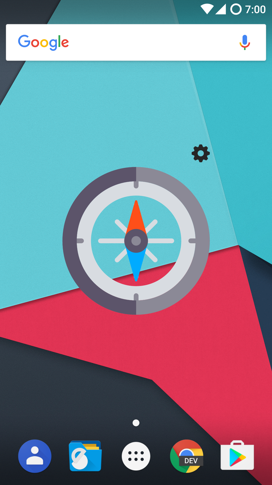
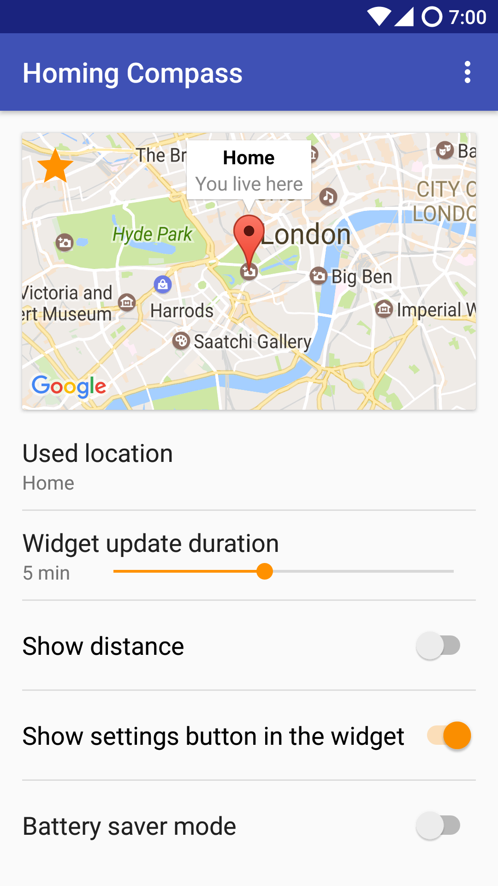
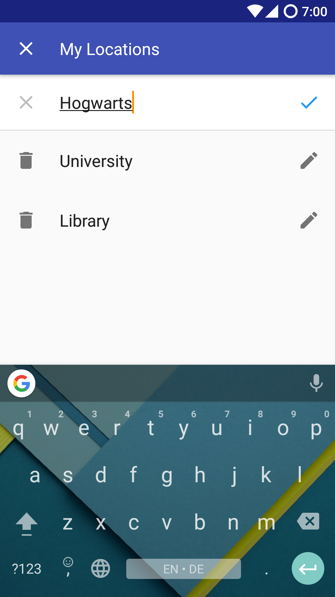
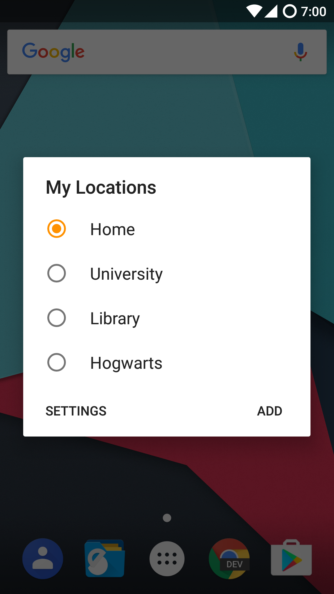
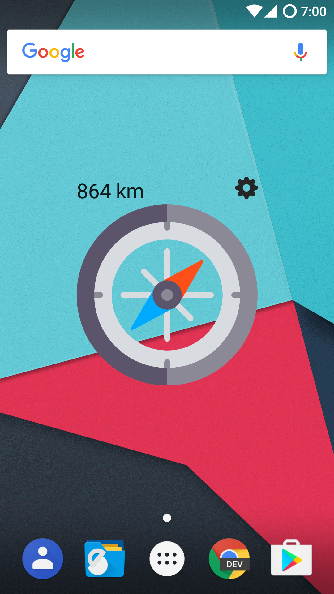

# HomingCompass

This app is a simple widget that shows you the direction and distance to any location in the world once you tap on it.

Click [here](https://github.com/CiriousJoker/HomingCompass/releases) to see all releases.

## Bugs / Feature Requests / Other Feedback
Just contact me over at ciriousjoker@gmail.com

## Screenshots

## Legal

This sourcecode is licensed under the [MIT license](LICENSE)

*Google Play and the Google Play logo are trademarks of Google Inc.*
